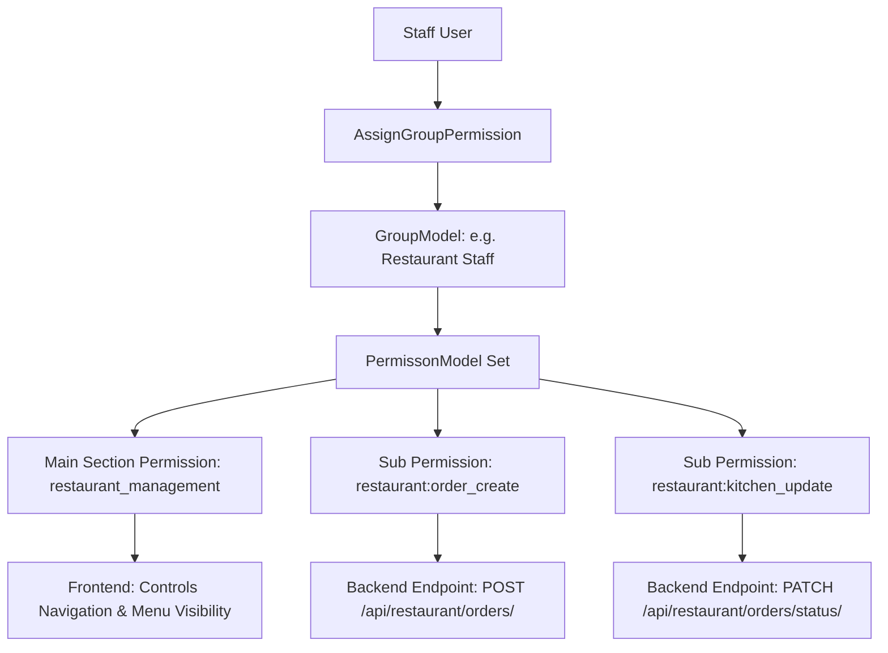
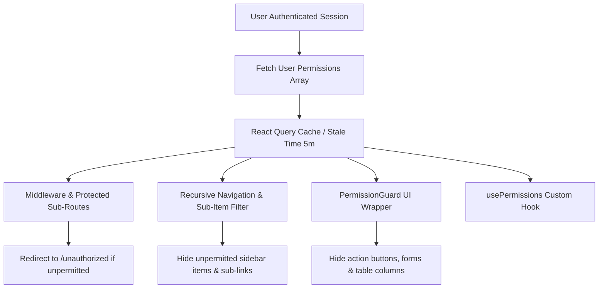

# Authorization Update: Granular Action-Level Sub-Permissions

This document presents the **Present State** of permissions in the system, defines proposed **Granular Action Sub-Permissions** for every section, and details the **New State** of backend role-based authorization.

---

## 1. Present State (Section-Level Blanket Permissions)

Currently, the system uses **17 main section-level permissions**. Holding a section's main permission grants full access (View, Create, Edit, Delete, Process) to all endpoints within that section.

| Section / Module | Main Permission String | Current Access Scope |
| :--- | :--- | :--- |
| **Member Management** | `member_management` | Full member CRUD, documents, family records |
| **Member Financials** | `member_financial_management` | View invoices, record payments, fees, dues |
| **Restaurant Operations** | `restaurant_management` | View menu, edit items, create orders, billing |
| **Outlets (Bar/Tea/Cigar)** | `outlet_management` | View items, cross-ordering rules, order billing |
| **Reservations** | `reservation_management` | Resource slots, booking creation, advance payment |
| **Facility Management** | `facility_management` | Facility definition, status toggles |
| **Event Management** | `event_management` | Event planning, registrations, expenses |
| **Attendance Management** | `attendance_management` | RFID cards, check-in/out logs, guest management |
| **Payroll Management** | `payroll_management` | Salary structures, payroll runs, payslips, loans |
| **Vendor Management** | `vendor_management` | Vendor offers, contract selection, vendor payments |
| **Activity Logs** | `activity_log_management` | System user activity logs |
| **Group & Permissions** | `group_permission_management` | Group CRUD, permission assignment |
| **Employee Onboarding** | `employee_onboarding` | Staff user registration |
| **User Access** | `view_all_users` | View all users list and details |
| **Bulk Emails** | `bulk_emails_management` | Email sending and logs |
| **Product Management** | `product_management` | Product inventory and items |
| **Promo Codes** | `promo_code_management` | Promo code creation and discounts |

---

## 2. Proposed Granular Action Sub-Permissions (Action Scopes)

To enable precise backend authorization enforcement (e.g., allowing a user to `view` or `create_order` without allowing them to `delete` or `edit_menu`), we define granular action sub-permissions using formatted string namespaces (`section:action`):

### 📋 Member Management (`member`)
* `member:view` - View member directory and profile details.
* `member:create` - Add new member applications.
* `member:edit` - Update member personal information and documents.
* `member:delete` - Delete or soft-delete member accounts.
* `member:export` - Export member data reports.
* `member:approve` - Approve a pending member application (creates their login account).
* `member:reject` - Reject a pending member application.

### 💰 Member Financial Management (`member_financial`)
* `member_financial:view_invoices` - View member billing statements and ledgers.
* `member_financial:generate_invoice` - Issue new subscription or membership fees.
* `member_financial:process_payment` - Record payments and issue receipts.
* `member_financial:adjust_dues` - Adjust due limits or waive penalties.

### 🍽️ Restaurant Management (`restaurant`)
* `restaurant:view_menu` - Browse restaurant menu and item availability.
* `restaurant:menu_edit` - Add/edit menu items, prices, and spicy levels.
* `restaurant:order_create` - Place kitchen orders for members/tables.
* `restaurant:kitchen_update` - Advance kitchen order status (Preparing/Ready/Served).
* `restaurant:billing` - Finalize billing and settle payment modes.

### 🍸 Outlets Management (`outlet`)
* `outlet:view_menu` - Browse outlet drinks and items.
* `outlet:menu_edit` - Modify outlet catalogue items and prices.
* `outlet:order_create` - Place outlet orders.
* `outlet:billing` - Settle outlet bills.
* `outlet:cross_order_rule` - Configure cross-ordering rules between outlets.

### 📅 Reservations & Room Booking (`reservation`)
* `reservation:view` - View reservable resources and slot availability.
* `reservation:create` - Book a slot/room for a member.
* `reservation:cancel` - Cancel existing reservations.
* `reservation:process_advance` - Accept and record advance payments.

### 🏢 Facility Management (`facility`)
* `facility:view` - View facility lists and details.
* `facility:create` - Add new facilities.
* `facility:edit` - Edit facility capabilities and capacity.
* `facility:toggle_status` - Open or close facilities.

### 🎭 Event Management (`event`)
* `event:view` - Browse upcoming and past club events.
* `event:create` - Organize new events and schedules.
* `event:edit` - Modify event descriptions and food menus.
* `event:delete` - Cancel or remove events.
* `event:manage_expenses` - Record and approve event catering/logistics expenses.

### ⏱️ Attendance Management (`attendance`)
* `attendance:view_records` - View member and staff check-in logs.
* `attendance:check_in_out` - Record manual check-in/out.
* `attendance:card_issue` - Assign and configure RFID cards.
* `attendance:guest_register` - Register guests at gate/reception.

### 💵 Payroll Management (`payroll`)
* `payroll:view_structures` - View staff salary components and structures.
* `payroll:edit_structure` - Assign basic salaries and allowances to staff.
* `payroll:run_generate` - Generate monthly payroll runs.
* `payroll:pay_slip` - Process and mark payslips as paid.
* `payroll:manage_loans` - Issue staff loans and record deductions.

### 🚚 Vendor Management (`vendor`)
* `vendor:view` - View vendor directory and service offers.
* `vendor:create` - Register new vendor profiles.
* `vendor:select_offer` - Approve and select vendor contracts.
* `vendor:record_payment` - Record payments disbursed to vendors.

### 📜 Activity Log (`activity_log`)
* `activity_log:view` - Audit system action logs.
* `activity_log:export` - Export audit trails.
* `activity_log:clear` - Purge or archive historical logs.

### 👥 Group & Permission Management (`group_permission`)
* `group:view` - View permission groups and members.
* `group:create` - Create new role groups.
* `group:edit` - Modify permissions assigned to groups.
* `group:delete` - Remove role groups.
* `group:assign_user` - Assign users to permission groups.

### 👤 Employee Onboarding (`employee_onboarding`)
* `employee:onboard` - Register new staff accounts (`is_staff=True`).
* `employee:deactivate` - Suspend or deactivate staff accounts.
* `employee:edit_profile` - Update staff designations and profiles.

### 🔍 User Access (`user_management`)
* `user:view_list` - List platform users.
* `user:view_detail` - Inspect user account details.
* `user:reset_password` - Trigger admin password resets for staff.

### 📧 Bulk Emails (`bulk_emails`)
* `email:view_logs` - Review dispatched emails and status.
* `email:send_single` - Send individual notifications.
* `email:send_bulk` - Broadcast announcements to member tiers.
* `email:template_edit` - Manage email notification templates.

### 📦 Product Management (`product`)
* `product:view` - Inspect product catalogues.
* `product:create` - Add new inventory items.
* `product:edit` - Update product attributes and pricing.
* `product:adjust_stock` - Perform inventory stock takes and adjustments.

### 🏷️ Promo Codes (`promo_code`)
* `promo_code:view` - List active discount vouchers.
* `promo_code:create` - Generate campaigns and promo codes.
* `promo_code:toggle_status` - Activate or revoke promo codes.

---

## 3. New State (Granular Hybrid Authorization Architecture)

In the updated state, the authorization architecture operates as a **Hybrid Model**:

### Key Highlights of the New State:
1. **Frontend Boundary (Main Section Perms)**: Frontend applications continue checking main permissions (e.g., `restaurant_management`) to toggle high-level navigation tabs, dashboards, and module routes.
2. **Backend Enforcement (Action Sub-Perms)**: API endpoints enforce specific action permissions. If a staff user has `restaurant:order_create` but lacks `restaurant:billing`, they can place orders but cannot bill them.
3. **Flexible Role Customization**: Administrators can create custom groups in `GroupModel` with any combination of main and sub-permissions to fit exact organizational hierarchies.

---

## 4. Frontend Integration Workflow & UI Component Visibility Control

To deliver a production-grade web application experience, the frontend mirrors the backend's hybrid authorization model through five integrated UI control mechanisms:

### Frontend Implementation Modules:

1. **Central Sub-Permission Registry (`src/lib/component_permissions.ts`)**:
   * Contains `sub_protected_routes` for direct sub-path checking.
   * Exports `UI_ACTION_PERMISSIONS` constants (e.g., `MEMBER_CREATE`, `MENU_EDIT`, `LOG_EXPORT`).
2. **Global Custom Hook (`src/hooks/usePermissions.ts`)**:
   * Exposes `hasPermission(permissionName)` and `hasAnyPermission(list)`.
   * Evaluates exact sub-permissions, master section fallbacks (e.g., `member_management` unlocking all `member:*` actions), and superadmin overrides (`isAdmin`).
3. **Declarative Component Guard (`src/components/common/PermissionGuard.tsx`)**:
   * Protects individual UI elements (buttons, forms, action icons).
   * Usage: `<PermissionGuard permission="member:create"><Button>Add Member</Button></PermissionGuard>`.
4. **Recursive Navigation Filter (`src/components/utils/Navigation_functions.tsx`)**:
   * Maps sub-navigation labels (e.g., "Add Member", "View Members", "Add restaurant item") to exact sub-permissions.
   * Recursively filters out unpermitted sub-links; if an entire section has 0 allowed sub-items, the section header is automatically hidden.
